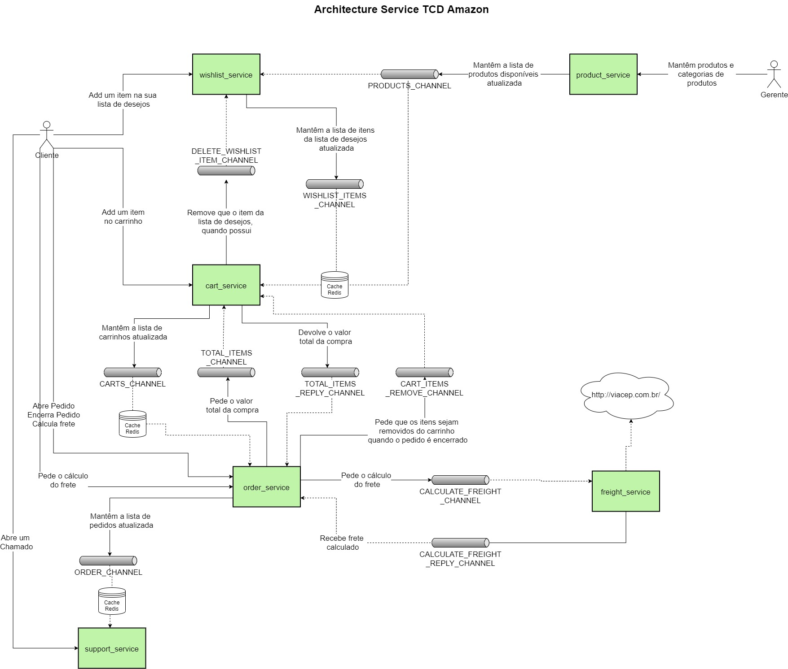

Este projeto é um exemplo de uma solução de "e-commerce" usando padrões de arquitetura, com 2 principais, que são: [SAGA with Choreography](https://microservices.io/patterns/data/saga.html) e [Event Sourcing](https://microservices.io/patterns/data/event-sourcing.html).

Ele foi criado visando 4 pilares.

- Resiliência
\
Neste projeto foram usados alguns artifícios para manter a resiliência dos serviços, como:

  - [Circuit Breaker](https://microservices.io/patterns/reliability/circuit-breaker.html):
    - A comunicação entre os serviços e o kafka. [Producers](./order_service/config/delivery_boy.rb) e [Consumers](./order_service/config/racecar.rb).
    - A comunicação entre o serviço de frete e a api do [Viacep](./freight_service/app/services/via_cep_service.rb).
  - Uso do [Redis](https://redis.io/) para guardar cache de informações entre serviços.
  - [Comunicação assíncrona](https://www.mitrais.com/news-updates/asynchronous-communication-between-microservices-with-apache-kafka/) entre os serviços.

- [Mensageria](https://microservices.io/patterns/data/event-sourcing.html)
\
Com o objetivo de manter a máxima resiliência da solução e o mais alto nível possível de disponibilidade foi usado [Kafka](https://kafka.apache.org/) como um message broker o que permite a comunicação entre os serviços de maneira assíncrona.

- [Gerenciamento de Configuração](https://microservices.io/patterns/externalized-configuration.html)
\
No nosso cenário não foi possível uma implementação aprofundada por uma limitação na linguagem usada no serviço. De todo modo, foi implementado um exemplo de solução usando [ETCD](https://etcd.io/) como serviço que responde chave/valor e o serviço de produtos [capturando dados](./product_service/config/delivery_boy.rb) de comunicação com o Kafka através de uma chamada ao etcd.

- [Service Discovery](https://microservices.io/patterns/client-side-discovery.html)
\
No nosso cenário não foi identificado uma necessidade latente de possuirmos uma implementação deste pilar, pois nenhum serviço conversa com outro diretamente. Ou seja, como a comunicação entre os serviços é assíncrona, vimos que este pilar foi "atendido" quando ativamos o Kafka.
\
\
Entretando, uma maneira de atender a este pilar de maneira elegante seria migrar nosso projeto hoje em [docker-compose](https://docs.docker.com/compose/) para [kubernetes](https://kubernetes.io/pt-br/) que nos entregaria soluções de service disovery muito eficiente e de fácil configuração.

---
---

# Motivadores

[PROBLEMA PROPOSTO 1](./PROBLEMA-PROPOSTO-1.md)

---
---

# Arquitetura do projeto



---
---

# Link dos serviços

- [KAFDROP](http://localhost:19000)
- [PRODUCT_SERVICE](http://localhost:1001/api-docs/index.html)
- [WISHLIST_SERVICE](http://localhost:1002/api-docs/index.html)
- [CART_SERVICE](http://localhost:1006/api-docs/index.html)
- [ORDER_SERVICE](http://localhost:1004/api-docs/index.html)
- [FREIGHT_SERVICE](http://localhost:1005/api-docs/index.html)
- [SUPPORT_SERVICE](http://localhost:1003/api-docs/index.html)

---
---

# Passos para execução do projeto

### Subir o projeto

```bash
chmod +x start.sh
sh start.sh
```

---
### Criar categoria

```bash
curl -X POST "http://localhost:1001/categories" -H  "accept: application/json" -H  "Content-Type: application/json" -d "{\"category\":{\"name\":\"Masculino Adulto\"}}"
```

---
### Criar 2 produtos

```bash
curl -X POST "http://localhost:1001/products" -H  "accept: application/json" -H  "Content-Type: application/json" -d "{\"product\":{\"name\":\"Camisa Azul\",\"value\":16.097,\"category_id\":1}}"
```

```bash
curl -X POST "http://localhost:1001/products" -H  "accept: application/json" -H  "Content-Type: application/json" -d "{\"product\":{\"name\":\"Camisa Vermelha\",\"value\":11.30,\"category_id\":1}}"
```

---
### Conferir produto postado no tópico do Kafka para montar um cache de itens no `wishlist_service` e `cart_service`
\
[PRODUCTS_CHANNEL](http://localhost:19000/topic/PRODUCTS_CHANNEL/messages?partition=0&offset=0&count=100&keyFormat=DEFAULT&format=DEFAULT)

---
### Visualizar os produtos de um determinado gênero

```bash
curl -X GET "http://localhost:1001/categories/1/products?popular=false" -H  "accept: application/json"
```

---
### Visualizar os detalhes de cada produto

```bash
curl -X GET "http://localhost:1001/products/1" -H  "accept: application/json"
```

```bash
curl -X GET "http://localhost:1001/products/2" -H  "accept: application/json"
```

---
### Buscar um produto por palavra-chave

```bash
curl -X GET "http://localhost:1001/products?popular=false&q%5Bname_cont%5D=azul" -H  "accept: application/json"
```

---
### Marcar um item como mais visto

```bash
curl -X GET "http://localhost:1001/products/1" -H  "accept: application/json"
```

---
### Exibir os produtos mais vistos por categorias

```bash
curl -X GET "http://localhost:1001/categories/1/products?popular=true" -H  "accept: application/json"
```

---
### Conferir chaves criadas no Configuration Manager [ETCD](https://etcd.io/)

```bash
docker-compose -f docker-compose-etcd.yml exec etcd /bin/sh -c "etcdctl --endpoints http://etcd:2379 get development/product_service --prefix"
```

---
### Criar uma lista de desejo vazia

```bash
curl -X POST "http://localhost:1002/wishlists" -H  "accept: application/json" -H  "Content-Type: application/json" -d "{\"wishlist\":{\"client_id\":100}}"
```

---
### Adicionar itens na sua lista de desejo

```bash
curl -X POST "http://localhost:1002/wishlists/1/items" -H  "accept: application/json" -H  "Content-Type: application/json" -d "{\"item\":{\"product_id\":1}}"
```

---
### Tentar adicionar um item na lista de desejo com produto inválido

```bash
curl -X POST "http://localhost:1002/wishlists/1/items" -H  "accept: application/json" -H  "Content-Type: application/json" -d "{\"item\":{\"product_id\":999}}"
```

---
### Conferir item da lista de desejo postado no tópico do Kafka para montar um cache de itens no `cart_service`
\
[WISHLIST_ITEMS_CHANNEL](http://localhost:19000/topic/WISHLIST_ITEMS_CHANNEL/messages?partition=0&offset=0&count=100&keyFormat=DEFAULT&format=DEFAULT)

---
### Adicionar um item no carrinho

```bash
curl -X POST "http://localhost:1006/carts/100/items" -H  "accept: application/json" -H  "Content-Type: application/json" -d "{\"item\":{\"product_id\":2,\"amount\":3}}"
```

---
### Tentar adicionar um item no carrinho com produto inválido

```bash
curl -X POST "http://localhost:1006/carts/100/items" -H  "accept: application/json" -H  "Content-Type: application/json" -d "{\"item\":{\"product_id\":99,\"amount\":3}}"
```

---
### Mover um item da lista de desejo para o carrinho

```bash
curl -X POST "http://localhost:1006/carts/100/items" -H  "accept: application/json" -H  "Content-Type: application/json" -d "{\"item\":{\"wishlist_item_id\":1,\"amount\":5}}"
```

---
### Conferir item da lista de desejo postado no tópico do Kafka para ser removido da lista de desejo correspondente
\
[DELETE_WISHLIST_ITEM_CHANNEL](http://localhost:19000/topic/DELETE_WISHLIST_ITEM_CHANNEL/messages?partition=0&offset=0&count=100&keyFormat=DEFAULT&format=DEFAULT)

---
### Conferir que o item foi removido da `lista de desejo`

```bash
curl -X GET "http://localhost:1002/wishlists/1/items" -H  "accept: application/json"
```

---
### Conferir que o item foi marcado para ser removido na fila do kafka que mantem o cache de itens
\
[WISHLIST_ITEMS_CHANNEL](http://localhost:19000/topic/WISHLIST_ITEMS_CHANNEL/messages?partition=0&offset=0&count=100&keyFormat=DEFAULT&format=DEFAULT)

---
### Abrir um pedido

```bash
curl -X POST "http://localhost:1004/orders/open" -H  "accept: application/json" -H  "Content-Type: application/json" -d "{\"order\":{\"cart_client_id\":100}}"
```

---
### Tentatar criar um pedido com um carrinho/cliente inválido

```bash
curl -X POST "http://localhost:1004/orders/open" -H  "accept: application/json" -H  "Content-Type: application/json" -d "{\"order\":{\"cart_client_id\":225}}"
```

---
### Conferir pedido postado no tópico do Kafka para montar um cache de pedidos no `support_service`
\
[ORDERS_CHANNEL](http://localhost:19000/topic/ORDERS_CHANNEL/messages?partition=0&offset=0&count=100&keyFormat=DEFAULT&format=DEFAULT)

---
### Conferir que o pedido ao ser criado solicita o total de itens no carrinho para o serviço `cart_service`
\
[TOTAL_ITEMS_CHANNEL](http://localhost:19000/topic/TOTAL_ITEMS_CHANNEL/messages?partition=0&offset=0&count=100&keyFormat=DEFAULT&format=DEFAULT)

---
### Conferir a resposta do total de itens no carrinho feito pelo serviço `cart_service` para o serviço `order_service`
\
[TOTAL_ITEMS_REPLY_CHANNEL](http://localhost:19000/topic/TOTAL_ITEMS_REPLY_CHANNEL/messages?partition=0&offset=0&count=100&keyFormat=DEFAULT&format=DEFAULT)

---
### Verificar o valor total e a quantidade total de itens no pedido, que são calculados com base no que há no carrinho

```bash
curl -X GET "http://localhost:1004/orders/1" -H  "accept: application/json"
```

---
### Calcular o frete de uma compra com um CEP válido

```bash
curl -X POST "http://localhost:1004/orders/1/freight" -H  "accept: */*" -H  "Content-Type: application/json" -d "{\"freight\":{\"zip_code\":\"02512000\"}}"
```

---
### Tentar calcular o frete de uma compra com um CEP inválido

```bash
curl -X POST "http://localhost:1004/orders/1/freight" -H  "accept: */*" -H  "Content-Type: application/json" -d "{\"freight\":{\"zip_code\":\"02599999\"}}"
```

---
### Conferir o pedido cálculo de frete postado no tópico do Kafka para o serviço `freight_service`
\
[CALCULATE_FREIGHT_CHANNEL](http://localhost:19000/topic/CALCULATE_FREIGHT_CHANNEL/messages?partition=0&offset=0&count=100&keyFormat=DEFAULT&format=DEFAULT)

---
### Conferir o retorno do serviço `freight_service` postado no tópico referente ao pedido de cálculo de frete que será consumido pelo serviço `order_service`
\
[CALCULATE_FREIGHT_REPLY_CHANNEL](http://localhost:19000/topic/CALCULATE_FREIGHT_REPLY_CHANNEL/messages?partition=0&offset=0&count=100&keyFormat=DEFAULT&format=DEFAULT)

---
### Acompanhar os dados do seu pedido, com todos os valores calculados

```bash
curl -X GET "http://localhost:1004/orders/1" -H  "accept: application/json"
```

---
### Abrir um chamado técnico de algum problema que está acontecendo

```bash
curl -X POST "http://localhost:1003/tickets/open" -H  "accept: application/json" -H  "Content-Type: application/json" -d "{\"ticket\":{\"description\":\"Problema X Y Z\",\"client_id\":100,\"order_id\":1}}"
```

---
### Encerrar um chamado técnico

```bash
curl -X POST "http://localhost:1003/tickets/closed" -H  "accept: application/json" -H  "Content-Type: application/json" -d "{\"ticket\":{\"id\":1}}"
```

---
### Encerrar um pedido

```bash
curl -X POST "http://localhost:1004/orders/closed" -H  "accept: application/json" -H  "Content-Type: application/json" -d "{\"order\":{\"id\":1}}"
```

---
### Conferir carrinho postado no tópico do Kafka para que seus itens sejam removidos em `cart_service`
\
[CART_ITEMS_REMOVE_CHANNEL](http://localhost:19000/topic/CART_ITEMS_REMOVE_CHANNEL/messages?partition=0&offset=0&count=100&keyFormat=DEFAULT&format=DEFAULT)

---
### Conferir carrinho vazio

```bash
curl -X GET "http://localhost:1006/carts/100/items" -H  "accept: application/json"
```

---
### Derrubar o projeto

```bash
chmod +x stop.sh
sh stop.sh
```
